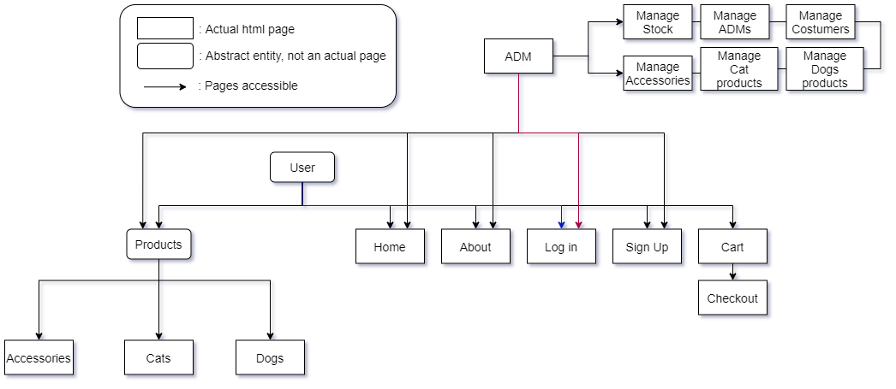

# Shop do pet
*Made by:*
- Dennis Lemke Green, 11219108.
- Gabriel Tavares Brayn Rosati, 11355831.
- Filipe Augusto Oliveira da Costa, 11219161.
- Pedro Henrique Magalhães Cisdeli, 10289804.
# To-do
- [x] Single Page Application
- [ ] Tests
- [ ] Comment Code
- [ ] Fill in project Report
### Appearance
- [x] Checkout Page
- [x] Cart page
- [ ] _Unique Feature_
### JS Functionalities
- [x] Login
- [x] ItemPage->Cart->Checkout

# Project Report
### Requirements
* README file contains the Project Report and the designated topics for the first milestone.
* Our navigation diagram is included in the [Project Description](#Project-Description) topic.
* The mockup designed covers all major pages: ADM, Home, 3 store categories (Accessories, Cat, Dog), About Us, Login and Sing up.
* Minor pages that weren't designed yet: cart, checkout and _Unique Feature_.
### Project Description
* Our project was designed using bootstrap linked through a CDN so you won't need to download any external frameworks for now.
* All resources used are linked in the footer of every page.
* _Unique Feature_: it will be later implemented in the Accessories page as a custom shop for collars and tags for your pets. The user will be able to choose from a variety of pendants and colors as well as the info contained in the tag. We decided to delay the implementation of this feature so we can use JavaScript in it.
* Functionalities that we pretend to add: logic behind the ADM manage buttons and cart, the _Unique Feature_ and both Login and Sing Up systems.  

<h3 align="center">Navigation Diagram</h3>

### Comments About the Code
* _Any comment you may want to add to help understand your code. This is good programming practice._
### Test Plan
* _Text describing the tests that will be performed._
* _If an automatic test tool/framework is used (ex: [Selenium](https://www.selenium.dev/), [jUnit](https://junit.org/junit5/), [Spock](https://spockframework.org/)), the code for the tests can be used._
### Test Results
* _Text describing the test results. If an automatic test tool/framework is used, its output can be used._
### Build Procedures
* _A step-by-step guide to run your code._
* _You should start telling how to install whatever software you need, then how to download/build your program, and finally how to set up the environment to run it. Imagine that someone installing will just follow these commands (nothing more)._
### Problems
* _List any major problems you had._
### Comments
* ELABORATE Some features are outputted through alerts, make sure not to disable them to get the all functionalities.
* ELABORATE Safety disclaimer
* ELABORATE Functionalities not added because there is no backend
